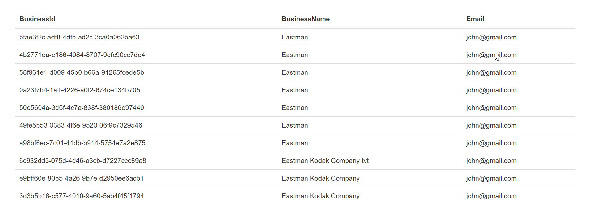
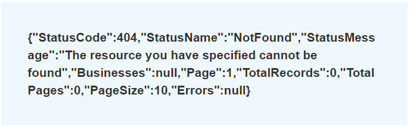

# TaxBandits OAUTH API SDK
## Introduction
In this SDK, we demonstrate how to generate **JWT** (JSON Web Token) by generating **JWS** (JSON Web Signature) with user credentials provided from TaxBandits Console Site using React JS as frontend and Node JS as backend.
## Cloning and Running the Application in local

 - Clone the project into your local machine.
    ```bash
    git clone https://github.com/SPAN-Enterprises/TaxBandits-SDK.git
    ```
 - Let's Navigate into the OAUTH API folder.
 - Open the frontend and backend folder path in a separate integrated terminals, so we can run our frontend and backend in two different ports.

## Dependencies Used
### Runtime dependencies
#### Node JS Application
 - **express** - The server for handling and routing HTTP requests.
 - **dotenv** - It is used to load environment variables.
 - **axios** - This library is used to make HTTP Calls.
 - **jws** - This library used for generating JWT (JSON Web Token).
 - **moment** - This library used for converting current date into (MM/DD/YYYY) format.
 - **cors** - CORS (Cross-Origin Resource Sharing) helps frontend client to make requests for resources to an external backend server.
#### React JS Application
 - **axios** - This library is used to make HTTP Calls from backend.
#### Development dependencies
 - **nodemon** - helps with the speedy development of Node.js application.
 ### NPM Installation
 - In both frontend and backend, type the following command to install npm packages that are mentioned in package.json file. 
    ```bash
    npm install
    ```
 - In order to run the application, type the following command in both frontend and backend terminals. 
    ```bash
    npm run start
    ```
 - Node JS Application Runs on  **localhost:3000** and React JS Application Runs on  **localhost:3001**.

## Application Structure
#### Node JS Application
-   `.env`  - This file consists of environment variables.
    - **PORT** - Describes in which port our application runs on.
    - **TBS_PUBLIC_API_OAUTH** - Authentication Server URL that we used to generate JWT token.
    -  **TBS_PUBLIC_API_BASE_URL** - Authentication Server URL that we used for listing business.
    - **PAGE** - It is passed as params for Business/List API.
    - **PAGE_SIZE** - It is passed as params for Business/List API.
	- **FROM_DATE** - It is passed as params for Business/List API.
-   `package.json`  - This file stores our application information such as name, version, dependencies and more on. 
-   `package-lock.json`  - This is a **lockfile** that contains information about the dependencies/packages with their version numbers that were installed for our node.js project.
-   `server.js`  - The **entry point** to our **nodejs application**. This file defines our express server. It also requires the routes and controllers we'll be using in the application.
-   `routes`  - This folder contains the route definitions for our API.
    -   `routes/user/userRoute.js`  - In this file we define the route for generating JWT token.
    -  `routes/business/listBusinessRoute.js`  - In this file we define the route for listing business against generated JWT token.
-   `controllers/`  - This folder is responsible for handling incoming requests and returning responses to the client.
    -   `controllers/user/userControllers.js`  - This file contains a function that defines the JWS and JWT response sent to a client when making a request to the server.
    - `controllers/business/listBusinessController.js`  - This file contains a function that defines the list business response sent to a client when making a request to the server.
-   `utils/`  - This folder contains functions that is used for controllers.
    -   `utils/unixEpoch.js`  - This file contains function that is used for unixEpoch conversion that is passed as payload for generating JWS key.
#### React JS Application
-   `package.json`  - This file stores our application information such as name, version , dependencies and more on. 
-   `package-lock.json`  - This is a **lockfile** that contains information about the dependencies/packages with their version numbers that were installed for our react.js project.
-   `public/`  - This folder contains the HTML file and static assets such as images, svgs, and fonts for our React app.
-   `src/`  - This is a folder that contains our source code.
-   `src/index.js`  - This file is the **entry point** for our **reactjs application** and contains the logic for rendering our App component. 
-   `src/app.js`  -  This file is our App component.
-   `src/styles/`  -  This file contains css, bootstrap and fonts file used in our app.
-   `src/pages/`  -  The files in the pages folder indicate the route of the react application.
    -   `src/pages/GenerateJWTToken.js`  - This file contains html integration for generating JWT token by passing user credentials as input. With the generated token we'll verify it by hitting the list method in Business Endpoint.

## JWS Authorization
Using JWS npm, we generate signature by passing headers, payload and secret key.
```js
const header = {  
    "alg":  "HS256",  /*Algorithm = HS256*/  
    "typ":  "JWT"  /*Type = JSON Web Token (JWT)*/  
}
```
```javascript
const payload = {
    "iss": clientId, /*Issuer: Client ID retrieved from the console site*/
    "sub": clientId, /*Subject: Client ID retrieved from the console site*/
    "aud": userToken, /*Audience: User Token retrieved from the console site*/
    "iat": parseInt(unixEpochStringConversion) /*Issued at: Number of seconds from Jan 1 1970 00:00:00 (Unix epoch format)*/
}
```
In the above payload, unixEpochStringConversion is used to convert the current time to Unix Epoch format in our project.

>Note : You can get your own ClientId, Secret key and User Token from our TaxBandits Console Site. [Goto TaxBandits Console Site](https://sandbox.taxbandits.com/)

```javascript
const signature = jws.sign({
    header: header,
    payload: payload,
    secret: secretKey, /*Client Secret retrieved from the console site*/
})
```
### Sample JWS
```
eyJhbGciOiJIUzI1NiIsInR5cCI6IkpXVCJ9.eyJpc3MiOi  
I5NjhhOWM3OGRhZTI5YTI5Iiwic3ViIjoiOTY4YTljNzhkYWUyOWEyOSIsImF1  
ZCI6ImE1NzRiNzVmMThiMjRmYzA5ZjkwMzlmZmI1Y2IwOGYzIiwiaWF0IjoxN  
TE2MjM5MDIyfQ.HNQznxlPyVt62kyUeVwtk1-uzm1uDWH4NBDLShA6Ac0
```
## JWT Authentication
Once the JWS is created, then send a request to the Authentication Server by passing JWS in headers for an generating Access token.
**Authentication Server URL:** [https://testoauth.expressauth.net/v2/tbsauth]
```javascript
headers: {
Authentication:signature  // Pass JWS as Authentication in headers
}
```
### Sample JWT
```
eyJhbGciOiJIUzI1NiIsInR5cCI6IkpXVCJ9.eyJpc3  
MiOiJ0ZXN0YXBpLnRheGJhbmRpdHMuY29tIiwiYXVkI  
joiYTU3NGI3NWYxOGIyNGZjMDlmOTAzOWZmYjVjYjA4ZjMiLCJp  
YXQiOjE1OTU5MjAxMjQsImV4cCI6MTU5NTkyNzMyNH0.BIg8764SOhOai9As  
3uRSidrF1-B9CxL6D5z4OggcVbs
```
Once you obtain the JWT (Access token), you can use the same JWT along with every API request until the token expires.

>Note: Your JWT will expires in One hour from the time of creation.

## Verify JWT
- You can verify your JWT is valid by clicking on the Verify JWT button.
- If there is any business under the User, it will be shown as a list of business by hitting Business/List method.
**Business/List API URL:** [https://testapi.taxbandits.com/v1.7.3/Business/List] 
    #### Sample Business List
    

- If there is no business under the User, it shows the response from the list method in Business TBS Public API Base URL.
    #### Sample No Business found
    

For more information, please refer: https://developer.taxbandits.com/


